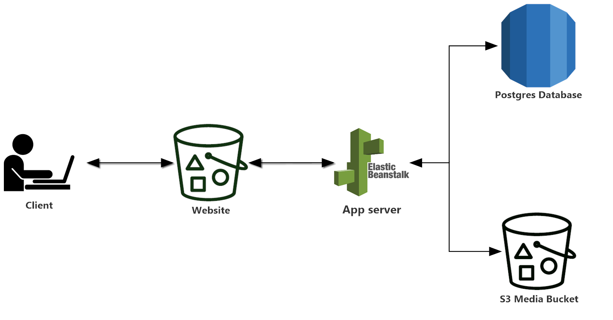
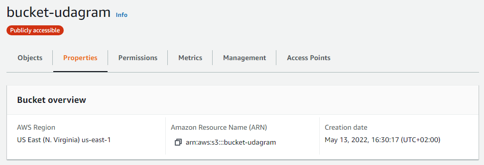
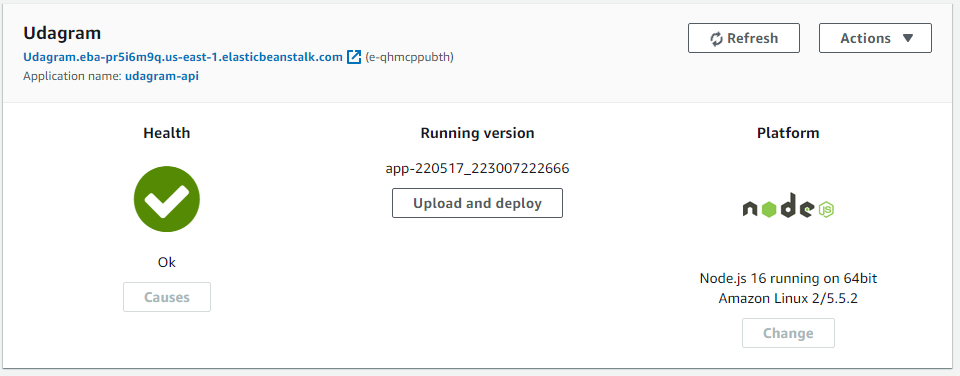
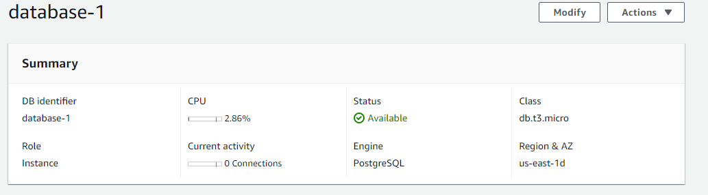
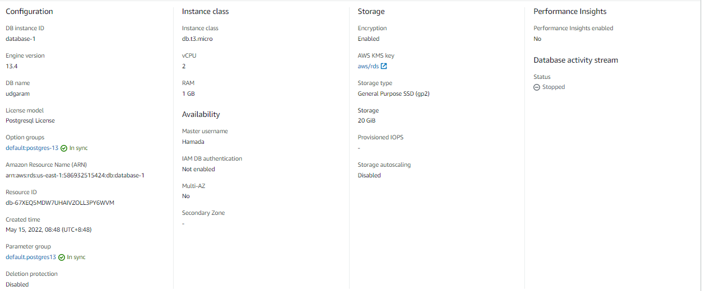

# Udagram Infrastructure

Udagram application is hosted on aws cloud services (S3 bucket , Elastic bean stack and RDS postgres)

## S3 bucket

Application front-end is hosted on a S3 bucket

Site URL : <http://bucket-udagram.s3-website-us-east-1.amazonaws.com>

## Elastic bean stack

App server is deployed on elastic bean service

Endpoint : <http://udagram.eba-pr5i6m9q.us-east-1.elasticbeanstalk.com>

## RDS postgres

App server uses a database provided on postgres RDS

Database Endpoint : database-1.cpekjjwik7ph.us-east-1.rds.amazonaws.com
